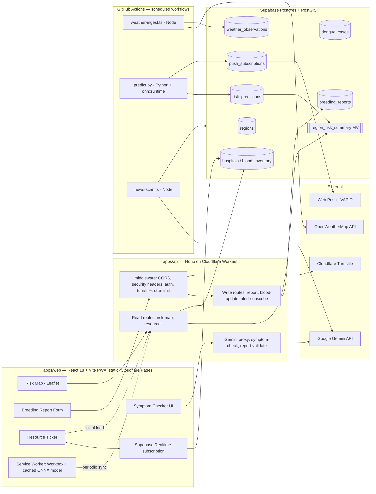

# Avash (আভাস)

**সুরক্ষার আগাম বার্তা** — "an early message of protection."

## The problem

Dengue outbreaks are largely predictable from weather patterns 2–4 weeks
in advance, but that lead time is rarely turned into an actionable public
signal in time to matter. Citizens have no easy way to report standing-water
breeding sites or find blood/hospital resources during a surge. Avash closes
that gap: a public risk map driven by a weather-based predictive model,
a citizen breeding-site reporting pipeline, and a live hospital/blood
resource ticker, all built as a Progressive Web App that keeps working
offline.

## Architecture summary

Avash is a two-app split (ADR-001): `apps/web` is a pure client-rendered
React SPA with zero server secrets; `apps/api` (Hono on Cloudflare
Workers) is the sole owner of secret-touching, per-request logic. Batch ML
inference and data ingestion run as scheduled GitHub Actions jobs talking
directly to Supabase/PostGIS — never as an HTTP endpoint (ADR-007). Full
detail in `docs/architecture.md`.



## Monorepo layout

```
.
├── .agents/           # Machine-readable agent task contracts
├── .claude/           # Claude project settings + reusable skills
├── .codex/            # Codex CLI config
├── .cursor/           # Cursor MCP server config
├── .github/           # CI/CD workflows + Dependabot
├── apps/
│   ├── web/           # React 18 + Vite PWA — static SPA, Cloudflare Pages
│   └── api/           # Hono on Cloudflare Workers — all secret-touching request logic
├── ml/                # Offline Python pipeline — training, evaluation, batch serving
├── packages/
│   ├── types/         # Single canonical source for shared TS types/schemas
│   ├── config/        # eslint-config, tsconfig base, tailwind-preset
│   ├── ui/             # Shared React design system
│   ├── db/             # Supabase migrations, RLS policies, generated types
│   ├── geo/             # PostGIS query builders
│   ├── ml-inference/    # ONNX model artifact + onnxruntime-web wrapper
│   ├── security/        # Rate limiter, Turnstile verifier, zod schemas
│   └── logger/           # Structured logger + PII redaction
├── scripts/            # setup.sh, seed-db.ts, refresh-materialized-views.ts, jobs/
├── docs/               # Architecture, standards, schema, ML, security docs
├── AGENTS.md
├── CLAUDE.md
├── CONTRIBUTING.md
├── SECURITY.md
├── package.json
├── pnpm-workspace.yaml
└── turbo.json
```

## Quickstart

**Prerequisites:** Node 20+, `pnpm` (`packageManager: pnpm@9.1.0`),
Python 3.11+ (for `ml/`), a Supabase project (for anything beyond the
static frontend/backend scaffold).

```bash
# install workspace dependencies
pnpm install

# run the frontend (React SPA)
pnpm --filter web dev

# run the backend (Hono Worker API)
pnpm --filter api dev
```

See `CLAUDE.md` for the full command reference (lint/typecheck/build/test,
DB migrations, ML training/export/inference).

## Documentation

| Doc | Purpose |
|---|---|
| [`docs/PROJECT_PLAN.md`](docs/PROJECT_PLAN.md) | Single source of truth — architecture, schema, security, constants |
| [`AGENTS.md`](AGENTS.md) | Hard rules for AI coding agents working in this repo |
| [`CONTRIBUTING.md`](CONTRIBUTING.md) | How to get a PR merged — branching, commits, testing, PR template |
| [`SECURITY.md`](SECURITY.md) | Vulnerability reporting, scope, controls in place |
| [`docs/README.md`](docs/README.md) | Full index of every document under `docs/` |

## Tech stack

| Layer | Technology |
|---|---|
| Frontend | React 18, Vite, React Router, TanStack Query, Leaflet |
| Backend | Hono, Cloudflare Workers |
| Database | Supabase Postgres + PostGIS |
| ML | LightGBM, ONNX Runtime (Python + WASM), SHAP |
| Auth | Supabase Auth, local HS256 JWT verification (`jose`) |
| Infra | Cloudflare Pages/Workers, GitHub Actions, Upstash Redis (rate limiting only) |
| LLM | Google Gemini (structured-output only, never the decision-maker) |

## Status

Actively under development. Governance and engineering-standards
documentation is in place, and the frontend scaffold — an installable,
typechecked, linted, and end-to-end-tested single-page React shell — is
implemented. See `docs/PROJECT_PLAN.md` §13 for the full vertical-slice
build order for everything still ahead.

## License

Not yet determined — treat this repository as all-rights-reserved until a
license file is added.
