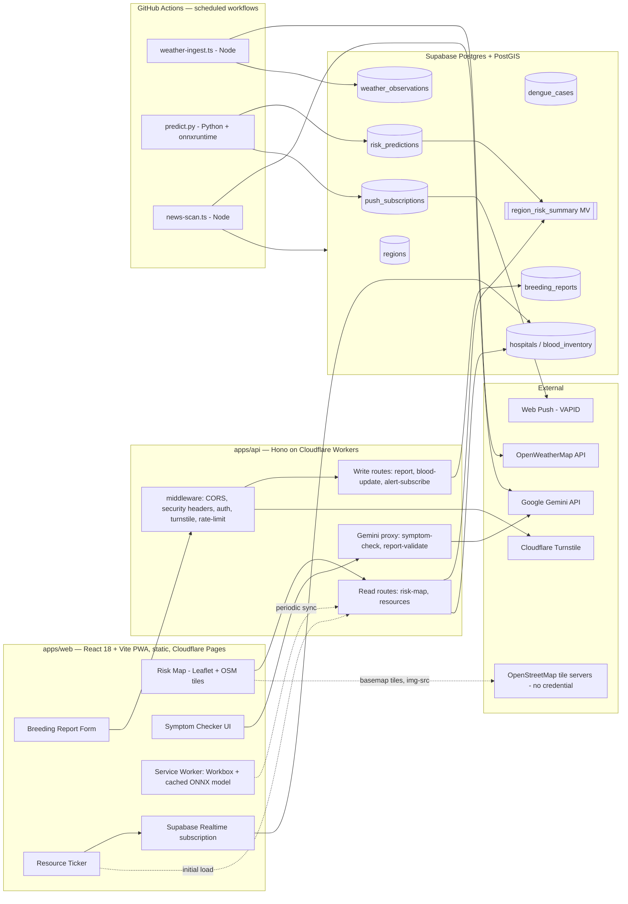

# Avash (আভাস)

**সুরক্ষার আগাম বার্তা** — "an early message of protection."

## The problem

Dengue outbreaks are largely predictable from weather patterns 2–4 weeks
in advance, but that lead time is rarely turned into an actionable public
signal in time to matter. Citizens have no easy way to report standing-water
breeding sites or find blood/hospital resources during a surge. Avash closes
that gap: a public risk map driven by a weather-based predictive model,
a citizen breeding-site reporting pipeline, and a live hospital/blood
resource ticker, all built as a Progressive Web App that keeps working
offline.

## Architecture summary

Avash is a two-app split (ADR-001): `apps/web` is a pure client-rendered
React SPA with zero server secrets; `apps/api` (Hono on Cloudflare
Workers) is the sole owner of secret-touching, per-request logic. Batch ML
inference and data ingestion run as scheduled GitHub Actions jobs talking
directly to Supabase/PostGIS — never as an HTTP endpoint (ADR-007). Full
detail in `docs/architecture.md`.



## Monorepo layout

```
.
├── .agents/           # Machine-readable agent task contracts
├── .claude/           # Claude project settings + reusable skills
├── .codex/            # Codex CLI config
├── .cursor/           # Cursor MCP server config
├── .github/           # CI/CD workflows + Dependabot
├── apps/
│   ├── web/           # React 18 + Vite PWA — static SPA, Cloudflare Pages (+ Dockerfile: nginx image)
│   └── api/           # Hono on Cloudflare Workers — all secret-touching logic (+ Dockerfile: Node image)
├── ml/                # Offline Python pipeline — training, evaluation, batch serving
├── packages/
│   ├── types/         # Single canonical source for shared TS types/schemas
│   ├── config/        # eslint-config, tsconfig base, tailwind-preset
│   ├── ui/             # Shared React design system
│   ├── db/             # Supabase migrations, RLS policies, generated types
│   ├── geo/             # PostGIS query builders
│   ├── ml-inference/    # ONNX model artifact + onnxruntime-web wrapper
│   ├── security/        # Rate limiter, Turnstile verifier, zod schemas
│   └── logger/           # Structured logger + PII redaction
├── scripts/            # setup.sh, seed-db.ts, refresh-materialized-views.ts, jobs/
├── docker/             # Shared infra images (ADR-011): ML runtime + PostGIS init SQL
├── docs/               # Architecture, standards, schema, ML, security docs
├── compose.yaml        # db + ml (infra), web + api behind the `apps` profile (ADR-012)
├── AGENTS.md
├── CLAUDE.md
├── CONTRIBUTING.md
├── SECURITY.md
├── package.json
├── pnpm-workspace.yaml
└── turbo.json
```

## Quickstart

**Prerequisites:** Node 20+, `pnpm` (`packageManager: pnpm@9.1.0`),
Python 3.11+ (for `ml/`), a Supabase project (for anything beyond the
static frontend/backend scaffold). Docker (Engine 25+ / Desktop 4.27+)
is **optional** — it provides a local PostGIS database and a pinned
Python runtime, and substitutes for the last two prerequisites; nothing
below needs it.

```bash
# install workspace dependencies
pnpm install

# create the three local environment files from their tracked templates
cp .env.example .env                                  # job scripts + ml/
cp apps/api/.dev.vars.example apps/api/.dev.vars      # Worker secrets
cp apps/web/.env.example apps/web/.env                # VITE_PUBLIC_* only

# run both apps concurrently (via turbo)
pnpm dev
# -> web:  http://localhost:5173
# -> api:  http://localhost:8787

# or run one app in isolation:
pnpm --filter web dev   # Vite dev server for the React SPA
pnpm --filter api dev   # wrangler dev for the Hono Worker API
```

Each `.env` / `.dev.vars` file is gitignored; only the `*.example`
templates are tracked, and they never contain a real value. The scaffold
runs with them left blank — values are needed once a slice actually calls
Supabase or Gemini. The risk map needs no credential at all: it renders
with Leaflet over OpenStreetMap tiles (ADR-013). See
[`docs/security/secrets-matrix.md`](docs/security/secrets-matrix.md) for
what each variable is, which of the three files it belongs in, and how it
is set in preview/production.

Verify the backend is up:

```bash
curl http://localhost:8787/health
```

### Optional: containers

```bash
# infrastructure (ADR-011)
pnpm docker:db          # Postgres 15 + PostGIS on 127.0.0.1:54322
pnpm docker:ml:build    # pinned Python 3.11 image for ml/
pnpm docker:ml python ml/training/train.py

# the two app images (ADR-012)
pnpm docker:apps:build  # avash-web:local + avash-api:local
pnpm docker:apps        # web on :8080, api on :8787
```

Infrastructure containers give you a database matching Supabase and a
reproducible ML runtime. The app images package each app to run anywhere —
`apps/web` as nginx serving the Vite build, `apps/api` as Node serving the
same Hono app through `@hono/node-server` — which is what makes the
project handover-ready without a Cloudflare account.

Production deploys are unchanged: Cloudflare Pages for the SPA and
`wrangler deploy` for the Worker. The images are a parallel artifact, and
because the API image runs on Node while production runs on workerd, CI
runs the API test suite against both. See
[`docs/docker.md`](docs/docker.md), ADR-011, and ADR-012.

See `CLAUDE.md` for the full command reference (lint/typecheck/build/test,
DB migrations, ML training/export/inference).

## Documentation

| Doc | Purpose |
|---|---|
| [`docs/PROJECT_PLAN.md`](docs/PROJECT_PLAN.md) | Single source of truth — architecture, schema, security, constants |
| [`AGENTS.md`](AGENTS.md) | Hard rules for AI coding agents working in this repo |
| [`CONTRIBUTING.md`](CONTRIBUTING.md) | How to get a PR merged — branching, commits, testing, PR template |
| [`SECURITY.md`](SECURITY.md) | Vulnerability reporting, scope, controls in place |
| [`docs/docker.md`](docs/docker.md) | Container runbook — local database, ML image, the two app images, dev container, and the CI image pipeline |
| [`docs/README.md`](docs/README.md) | Full index of every document under `docs/` |

## Tech stack

| Layer | Technology |
|---|---|
| Frontend | React 18, Vite, React Router, TanStack Query, Leaflet (OpenStreetMap tiles) |
| Backend | Hono, Cloudflare Workers |
| Database | Supabase Postgres + PostGIS |
| ML | LightGBM, ONNX Runtime (Python + WASM), SHAP |
| Auth | Supabase Auth, local HS256 JWT verification (`jose`) |
| Infra | Cloudflare Pages/Workers, GitHub Actions, Upstash Redis (rate limiting only) |
| Containers | Docker Compose — PostGIS + Python ML runtime (ADR-011); per-app images, nginx for web and Node for api, published to GHCR (ADR-012) |
| LLM | Google Gemini (structured-output only, never the decision-maker) |

## Status

Actively under development. Governance and engineering-standards
documentation is in place, and the frontend scaffold — an installable,
typechecked, linted, and end-to-end-tested single-page React shell — is
implemented. See `docs/PROJECT_PLAN.md` §13 for the full vertical-slice
build order for everything still ahead.

## License

Not yet determined — treat this repository as all-rights-reserved until a
license file is added.
