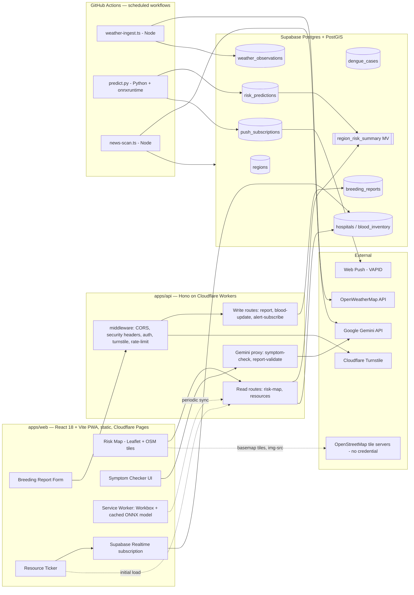

# Architecture

Avash (আভাস) is a dengue early-warning and citizen-response platform: a
public risk map backed by a 2–4 week predictive model, a breeding-site
reporting pipeline, a blood/hospital resource ticker, a symptom checker,
and a news aggregator — all built as a strict two-app split around a
Supabase/PostGIS data layer.

## System diagram

## Data flow, plain English

1. Every 3h, `cron-weather-ingest.yml` runs `scripts/jobs/weather-ingest.ts`
   (Node), pulls OpenWeatherMap data per region, writes to
   `weather_observations` using the Supabase service-role key (a GitHub
   Actions secret — never present in any deployed app).
2. Every 24h, `cron-batch-predict.yml` runs `ml/serving/predict.py`: loads
   the checksum-verified `.onnx` model, builds feature vectors per region
   straight from Supabase, runs `onnxruntime` (Python) inference, writes
   `risk_predictions`, refreshes `region_risk_summary`, and — for any
   region crossing into `high`/`severe` — sends Web Push notifications to
   matching `alert_subscriptions`/`push_subscriptions` via VAPID.
3. The map, dashboard, and resource pages (`apps/web`) read only from the
   materialized view / indexed tables through `apps/api` — fast,
   cacheable, cheap.
4. Citizen writes (breeding report, blood update) go through `apps/api`:
   Turnstile + rate limiter + Gemini-assisted validation before landing in
   Postgres, subject to RLS.
5. The blood/hospital ticker subscribes directly to Supabase Realtime from
   the browser for live updates (ADR-010) — no polling, no extra Worker
   load.
6. The PWA service worker caches the last-synced regional feature snapshot
   plus the ONNX model so a returning user gets an offline, on-device
   personal risk estimate — the genuine "edge AI" experience, running
   entirely in the user's browser via WASM.

## Why two apps, not one?

A React SPA has no server. Every piece of logic that must stay off the
client — Gemini calls, Supabase service-role writes, rate limiting,
Turnstile verification — needs an actual backend. `apps/api` (Hono on
Cloudflare Workers) is that backend: lightweight, edge-deployed, and
free-tier friendly for I/O-bound work (DB reads/writes, calling Gemini).
CPU-bound work (ONNX batch inference across every region) is deliberately
kept out of the Worker and run instead as scheduled GitHub Actions jobs
talking directly to Supabase — see ADR-002 and ADR-007. Full rationale in
`docs/adr/ADR-001-two-app-split.md`.

## Component responsibility boundaries

- **`apps/web`** — presentation and client-side interaction only. Reads
  public data through `apps/api` or directly from Supabase where RLS makes
  that safe (Realtime, ADR-010). Never holds a server secret.
- **`apps/api`** — the only owner of secret-touching, per-request logic:
  Gemini proxying, privileged writes, auth verification, rate limiting,
  Turnstile verification.
- **`scripts/jobs/*` and `ml/serving/*`** — the only owners of scheduled
  background work, run by GitHub Actions, talking directly to Supabase
  with the service-role key. Never HTTP-triggered (ADR-007).
- **`packages/*`** — shared, framework-agnostic logic and contracts (see
  the decision table below).

## What lives where — decision table

| Given this kind of logic... | ...it belongs in |
|---|---|
| A shared type, DTO, or zod schema used by more than one app | `packages/types` |
| A PostGIS query fragment (bbox clip, `ST_DWithin`) | `packages/geo` (builds fragments only — never executes a query or imports a Supabase client) |
| Rate-limit key generation, input validators, prompt-injection guards | `packages/security` |
| Structured logging, PII redaction, `withErrorBoundary()` | `packages/logger` |
| Reusable, routing-agnostic UI components | `packages/ui` |
| ONNX model wrapper for browser-side inference | `packages/ml-inference` |
| Migrations, RLS policies, generated Supabase types | `packages/db` |
| A React page/feature, a browser-only hook, client-side state | `apps/web` |
| A request handler, middleware, or anything reading `SUPABASE_SERVICE_ROLE_KEY`/`GEMINI_API_KEY`/other server secrets per-request | `apps/api` |
| A scheduled ingestion, prediction, or scan job | `scripts/jobs/*` (Node) or `ml/serving/*` (Python), invoked by a GitHub Actions `schedule` workflow |
| Model training, evaluation, and export (offline, not deployed) | `ml/training/`, `ml/evaluation/` |
| A local database, the pinned Python runtime, or an image CI needs | `compose.yaml` / `docker/` — shared infrastructure and reproducibility (ADR-011) |
| Packaging one app as a runnable image | That app's own `apps/*/Dockerfile` (ADR-012) — `apps/web` on nginx, `apps/api` on Node via `apps/api/server/node-server.ts`. Never inside `apps/api/src/**` |

See `docs/PROJECT_PLAN.md` §1 for the full repository layout this table
is derived from.

## Containers, and where they sit relative to the diagram

Nothing in the diagram above changes because of Docker — that is the
point of how containers are scoped here.

**Infrastructure containers (ADR-011)** — the PostGIS database and the
Python ML runtime in `compose.yaml`/`docker/` — sit entirely outside the
diagram. They are development and CI tooling: a database to test
migrations against, and a pinned Python image so a locally exported ONNX
artifact matches what the scheduled job produces. Neither is in a request
path.

**App images (ADR-012)** — `apps/web` and `apps/api` each ship an image —
are a *second packaging* of boxes already in the diagram, not new boxes.
The web image serves the same Vite output Cloudflare Pages serves; the API
image serves the same Hono app object the Worker serves, through a Node
adapter. Production still flows exactly as drawn: static bundle on Pages,
Worker on workerd. The images exist so the same system can run somewhere
else — a handover, a demo, a self-host — without a Cloudflare account.

The one place this genuinely complicates the picture is `apps/api`, which
now has two runtimes (workerd in production, Node in the image). That is
managed, not ignored: CI runs the API's test suite against both, so the
two stay behaviorally identical or the build goes red. See ADR-012 and
`docs/docker.md`.
