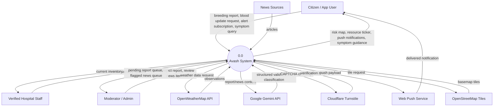
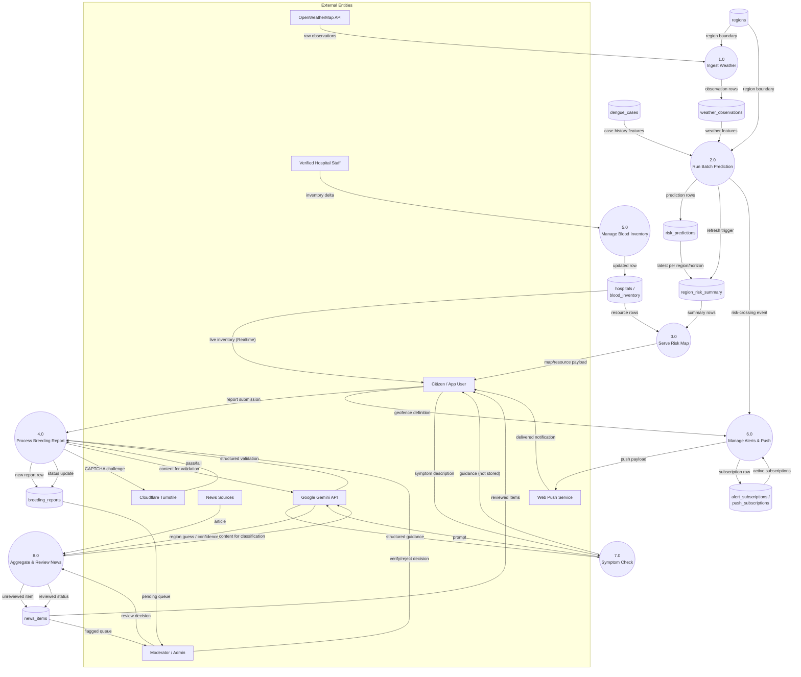

# Data Flow Diagrams

This document is a **Data Flow Diagram (DFD)** in the classic
Gane–Sarson sense — external entities, processes, data stores, and the
data flows between them — as distinct from `architecture.md`'s system
diagram (which shows *technology/deployment* boxes: apps, Workers, GitHub
Actions jobs) and `schema.md`'s ERD (which shows *table* relationships).
All three describe the same system from a different axis; none
supersedes the others.

Shape convention used below, consistent across both diagrams:

| Shape | Meaning |
|---|---|
| `[Rectangle]` | External entity — a person or system outside Avash's boundary |
| `(Rounded rectangle)` | Process — something that transforms or routes data |
| `[(Cylinder)]` | Data store — a Postgres table (or table group) in the Supabase database |

## Level 0 — Context Diagram

The whole system as a single process, showing every external entity that
sends data in or receives data out.

## Level 1 — Process Decomposition

`0.0 Avash System` decomposed into its constituent processes, mapped to
the data stores (Postgres tables, §4) they read and write.

## Reading notes

- **P2 (batch prediction) and P8 (news aggregation) run as scheduled
  GitHub Actions jobs**, not `apps/api` request handlers (R7, ADR-007) —
  the diagram shows *data* flow, which is identical regardless of which
  runtime executes the process.
- **P3 (serve risk map) never reads `risk_predictions` directly** — it
  reads only `region_risk_summary`, the materialized view, per the §4.2
  rule against live joins on the hot read path.
- **P5's read edge back to the citizen is Supabase Realtime**, not a
  request through `apps/api` (ADR-010) — the only data store in this
  document with a direct external-entity read edge that bypasses every
  process box.
- **P7 (symptom check) has no data store** — by design, symptom queries
  and Gemini's guidance are never persisted (privacy: no health data at
  rest for an unauthenticated feature).
- Every arrow into a data store from a process that isn't `P1`/`P2`/`P4`/
  `P5`/`P6`/`P8` would indicate an unreviewed write path and is
  intentionally absent — e.g. nothing writes to `D4`/`D5`
  (`risk_predictions`/`region_risk_summary`) except `P2`, matching the
  RLS stance in `rls-policies.md` (`insert`/`update` on those tables is
  service-role-only, never via a client role).

## Cross-reference

- Table-level structure and constraints: `schema.md` (§4).
- FK `on delete`/`on update` behavior referenced implicitly by the
  `D*` stores above: `schema.md` §4.3.
- RLS predicates gating who may read/write each store: `rls-policies.md`.
- Deployment/technology view of the same system: `../architecture.md`.
