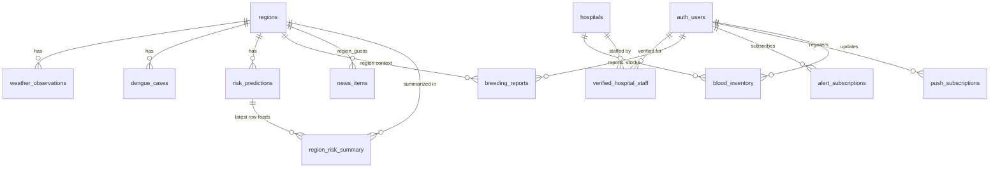

# Data Schema Reference

> **This document describes the target schema** as specified in
> `docs/PROJECT_PLAN.md` §4. The actual migration SQL is written in
> **Milestone 6** (`packages/db/supabase/migrations/`). Until M6 ships,
> this file documents intent, not a deployed database — do not assume any
> of these tables exist yet.

All tables live in the Supabase Postgres project with the `postgis` and
`pgcrypto` extensions enabled. Every geometry column uses SRID 4326
(WGS84 lat/lng) — see ADR-003.

## `regions`

Administrative boundaries (state/district/ward) used to bucket weather,
case history, and predictions spatially.

| Column | Type | Constraints | Meaning |
|---|---|---|---|
| `id` | `uuid` | PK, default `gen_random_uuid()` | Region identifier |
| `code` | `text` | unique, not null | Stable external code (e.g. admin code) |
| `name` | `text` | not null | Display name |
| `admin_level` | `smallint` | not null | 1=state, 2=district, 3=ward |
| `population` | `integer` | nullable | Used for `population_density` feature |
| `geom` | `geometry(MultiPolygon, 4326)` | not null | Region boundary |

**Indexes:** `idx_regions_geom` — GiST on `geom`. *Why:* every proximity
and containment query (map bbox clipping, "which region is this point in")
needs an index-accelerated spatial predicate; a GiST index is mandatory on
every geometry column (§4.2).

**Foreign keys:** none (root table).

## `weather_observations`

Append-only ingestion of weather readings per region, written by
`cron-weather-ingest.yml` every 3h (`WEATHER_INGEST_CADENCE`, §14).

| Column | Type | Constraints | Meaning |
|---|---|---|---|
| `id` | `bigint` | PK, identity | Row id |
| `region_id` | `uuid` | FK → `regions(id)` on delete cascade | Owning region |
| `observed_at` | `timestamptz` | not null | Observation timestamp |
| `temp_mean_c` | `numeric(4,1)` | nullable | Mean temperature |
| `temp_min_c` | `numeric(4,1)` | nullable | Min temperature |
| `temp_max_c` | `numeric(4,1)` | nullable | Max temperature |
| `humidity_pct` | `numeric(4,1)` | nullable | Relative humidity |
| `precipitation_mm` | `numeric(6,1)` | nullable | Precipitation |
| `source` | `text` | default `'openweathermap'` | Data provenance |
| `raw_payload` | `jsonb` | nullable | Original provider response, for debugging/backfill |

**Indexes:** `idx_weather_region_time` — composite `(region_id,
observed_at desc)`. *Why:* the "latest record per entity" access pattern
(feature engineering's rolling windows, §4.2) always filters by region and
orders by recency; a composite index serves both in one lookup.

**Foreign keys:** `region_id → regions(id)`.

**Note:** this table is append-only — no `update`/`delete` path exists in
the application; corrections are handled by inserting a corrected row, not
mutating history.

## `dengue_cases`

Historical epidemiological ground truth, weekly aggregates per region —
the label source for model training and the `case_lag_*` features.

| Column | Type | Constraints | Meaning |
|---|---|---|---|
| `id` | `bigint` | PK, identity | Row id |
| `region_id` | `uuid` | FK → `regions(id)` on delete cascade | Owning region |
| `reported_week` | `date` | not null | ISO week start (Monday) |
| `case_count` | `integer` | not null, `check (case_count >= 0)` | Weekly case count |
| `source` | `text` | nullable | Data provenance |

**Indexes:** `uq_cases_region_week` — unique `(region_id, reported_week)`.
*Why:* enforces exactly one aggregate per region per week, which both the
`SURGE_TARGET_THRESHOLD` label computation and the `case_lag_1/2/3`
features depend on.

**Foreign keys:** `region_id → regions(id)`.

## `risk_predictions`

Model output — two rows per region per batch run (`horizon_weeks` 2 and 4),
written by `cron-batch-predict.yml` every 24h (`BATCH_PREDICT_CADENCE`,
§14).

| Column | Type | Constraints | Meaning |
|---|---|---|---|
| `id` | `bigint` | PK, identity | Row id |
| `region_id` | `uuid` | FK → `regions(id)` on delete cascade | Owning region |
| `prediction_date` | `date` | not null | Date the prediction was generated for |
| `horizon_weeks` | `smallint` | not null, `check (horizon_weeks in (2, 4))` | Forecast horizon |
| `risk_score` | `numeric(4,3)` | not null, `check (risk_score between 0 and 1)` | Model probability output |
| `risk_level` | `text` | **generated always as** (stored) | Derived band — see below |
| `top_factors` | `jsonb` | nullable | SHAP top-3 contributing features, for the explainability UI |
| `model_version` | `text` | not null | Which model artifact produced this row |
| `generated_at` | `timestamptz` | default `now()` | Row creation time |

`risk_level` is a **generated stored column** implementing
`RISK_LEVEL_BANDS` (§14) exactly:
```sql
case when risk_score < 0.25 then 'low'
     when risk_score < 0.50 then 'moderate'
     when risk_score < 0.75 then 'high'
     else 'severe' end
```

**Constraints:** `horizon_weeks in (2,4)`; `risk_score between 0 and 1`;
unique `(region_id, horizon_weeks, prediction_date)`.

**Indexes:** `idx_predictions_region_date` — composite `(region_id,
prediction_date desc)`. *Why:* every read of "the latest prediction for
this region" is this exact access pattern.

**Foreign keys:** `region_id → regions(id)`.

## `region_risk_summary` (materialized view)

Read-optimized surface for the map — see ADR-006. Refreshed by
`scripts/refresh-materialized-views.ts`, invoked post-batch-predict, never
on the request path.

| Column | Source |
|---|---|
| `region_id` | `regions.id` |
| `name` | `regions.name` |
| `geom` | `regions.geom` |
| `risk_score`, `risk_level`, `horizon_weeks`, `generated_at` | latest matching `risk_predictions` row per `(region_id, horizon_weeks)` |

Definition: `distinct on (r.id, p.horizon_weeks)` over `regions` joined to
`risk_predictions`, ordered by `r.id, p.horizon_weeks, p.prediction_date desc`.

**Indexes:** `uq_summary_region_horizon` — **unique** `(region_id,
horizon_weeks)` (required for `refresh materialized view concurrently` —
without it, concurrent refresh fails at runtime); `idx_summary_geom` — GiST
on `geom`, for bbox-clipped map reads.

## `breeding_reports`

Citizen-submitted breeding-site reports (ADR-005: anonymous allowed).

| Column | Type | Constraints | Meaning |
|---|---|---|---|
| `id` | `uuid` | PK, default `gen_random_uuid()` | Report id |
| `reporter_id` | `uuid` | FK → `auth.users(id)`, nullable | Null for anonymous submissions |
| `geom` | `geometry(Point, 4326)` | not null | Report location |
| `description` | `text` | nullable | Free-text description |
| `photo_url` | `text` | nullable | Optional photo evidence |
| `ai_validation` | `jsonb` | nullable | Gemini structured-output payload (§5.4) |
| `status` | `text` | not null, default `'pending'`, `check (status in ('pending','verified','rejected','resolved'))` | Moderation state |
| `verified_by` | `uuid` | FK → `auth.users(id)`, nullable | Moderator who actioned the report |
| `municipal_ref_id` | `text` | nullable | External tracking reference once escalated |
| `created_at` | `timestamptz` | default `now()` | Submission time |

**Indexes:** `idx_breeding_geom` — GiST on `geom`; `idx_breeding_pending` —
**partial** index on `(status)` where `status = 'pending'`. *Why partial:*
the moderator queue only ever queries pending reports — indexing just that
subset keeps the index small and the queue query fast as `verified`/
`rejected`/`resolved` rows accumulate.

**Foreign keys:** `reporter_id → auth.users(id)`, `verified_by → auth.users(id)`.

## `hospitals`

| Column | Type | Constraints | Meaning |
|---|---|---|---|
| `id` | `uuid` | PK, default `gen_random_uuid()` | Hospital id |
| `name` | `text` | not null | Display name |
| `geom` | `geometry(Point, 4326)` | not null | Location |
| `address` | `text` | nullable | Street address |
| `phone` | `text` | nullable | Contact number |
| `verified` | `boolean` | default `false` | Admin-verified listing |
| `updated_at` | `timestamptz` | default `now()` | Last edit |

**Indexes:** `idx_hospitals_geom` — GiST on `geom`. *Why:* nearest-hospital
and bbox map queries.

**Foreign keys:** none.

## `blood_group` (enum)

```sql
create type blood_group as enum ('A+','A-','B+','B-','AB+','AB-','O+','O-');
```

All 8 standard blood groups. Used by `blood_inventory.blood_group`.

## `blood_inventory`

| Column | Type | Constraints | Meaning |
|---|---|---|---|
| `id` | `bigint` | PK, identity | Row id |
| `hospital_id` | `uuid` | FK → `hospitals(id)` on delete cascade | Owning hospital |
| `blood_group` | `blood_group` | not null | Which group this row tracks |
| `units_available` | `integer` | not null, default `0`, `check (units_available >= 0)` | Whole-blood units |
| `platelet_units` | `integer` | default `0`, `check (platelet_units >= 0)` | Platelet units |
| `updated_by` | `uuid` | FK → `auth.users(id)`, nullable | Who last updated this row |
| `updated_at` | `timestamptz` | default `now()` | Last update |

**Constraints:** unique `(hospital_id, blood_group)` — exactly one
inventory row per hospital per blood group.

**Foreign keys:** `hospital_id → hospitals(id)`, `updated_by → auth.users(id)`.

## `verified_hospital_staff`

Join table gating who may update a hospital's `blood_inventory`.

| Column | Type | Constraints | Meaning |
|---|---|---|---|
| `user_id` | `uuid` | FK → `auth.users(id)`, PK (composite) | Staff member |
| `hospital_id` | `uuid` | FK → `hospitals(id)`, PK (composite) | Hospital they're verified for |

**Foreign keys:** `user_id → auth.users(id)`, `hospital_id → hospitals(id)`.

## `alert_subscriptions`

Proximity geofence definitions for push alerting.

| Column | Type | Constraints | Meaning |
|---|---|---|---|
| `id` | `uuid` | PK, default `gen_random_uuid()` | Subscription id |
| `user_id` | `uuid` | FK → `auth.users(id)` on delete cascade | Owner |
| `geom` | `geometry(Point, 4326)` | not null | Watch-point location |
| `radius_m` | `integer` | not null, default `2000`, `check (radius_m between 100 and 20000)` | Alert radius, matches `ALERT_PROXIMITY_RADIUS_DEFAULT_M` bounds (§14) |
| `active` | `boolean` | default `true` | Whether alerts are currently delivered |
| `created_at` | `timestamptz` | default `now()` | Creation time |

**Indexes:** `idx_alerts_geom` — GiST on `geom`. *Why:* the batch-predict
job's `ST_DWithin` proximity check against every active subscription needs
this to be indexed, not a sequential scan, as subscription volume grows.

**Foreign keys:** `user_id → auth.users(id)`.

## `push_subscriptions`

Web Push delivery targets — one row per browser subscription per device.

| Column | Type | Constraints | Meaning |
|---|---|---|---|
| `id` | `uuid` | PK, default `gen_random_uuid()` | Row id |
| `user_id` | `uuid` | FK → `auth.users(id)` on delete cascade | Owner |
| `endpoint` | `text` | not null, unique | Push service endpoint URL |
| `p256dh` | `text` | not null | Push encryption key |
| `auth_key` | `text` | not null | Push auth secret |
| `created_at` | `timestamptz` | default `now()` | Registration time |

**Foreign keys:** `user_id → auth.users(id)`.

## `news_items`

News aggregator agent output (§5.4), pending moderator review before it
can influence anything public-facing.

| Column | Type | Constraints | Meaning |
|---|---|---|---|
| `id` | `bigint` | PK, identity | Row id |
| `source_url` | `text` | not null, unique | Prevents re-ingesting the same article |
| `title` | `text` | nullable | Article title |
| `published_at` | `timestamptz` | nullable | Publish timestamp |
| `region_guess` | `uuid` | FK → `regions(id)`, nullable | Gemini-inferred region association |
| `ai_confidence` | `numeric(3,2)` | nullable | Confidence score for `region_guess`/classification |
| `flagged` | `boolean` | default `false` | Needs human attention |
| `reviewed` | `boolean` | default `false` | Human review complete — gates any public-facing use |
| `created_at` | `timestamptz` | default `now()` | Ingestion time |

**Foreign keys:** `region_guess → regions(id)`.

---

## 4.1 Row Level Security (representative policies)

Full detail and every operation for every table lives in
`docs/data-schema/rls-policies.md`. Summary:

| Table | Policy | Rule |
|---|---|---|
| `breeding_reports` | insert | any role (incl. `anon`) — abuse handled by rate-limit + Turnstile in `apps/api`, not RLS |
| `breeding_reports` | select | `status = 'verified'` OR `reporter_id = auth.uid()` |
| `breeding_reports` | update | only `role() in ('moderator','admin')` |
| `blood_inventory` | select | public (`anon`) — required for direct Realtime subscription (ADR-010) |
| `blood_inventory` | update | `auth.uid() in (select user_id from verified_hospital_staff where hospital_id = blood_inventory.hospital_id)` |
| `alert_subscriptions`, `push_subscriptions` | all | `user_id = auth.uid()` only |
| `risk_predictions`, `hospitals` (select) | select | public (`anon`) |

RLS is **on** for every table by default; a table without RLS enabled must
have an ADR justifying it.

## 4.2 Indexing & Query Discipline

- Every geometry column: **GiST index**, non-negotiable.
- Every "latest record per entity" query: composite index
  `(entity_id, timestamp desc)`.
- Every hot read path for the UI: served from a materialized view or
  covering index, never a live `ST_DWithin` join against raw tables on the
  request path.
- Statement timeout: `5s` enforced at the Supabase connection role level
  (`DB_STATEMENT_TIMEOUT_S`, §14) to prevent runaway spatial queries from
  starving the pool.

## Entity-Relationship Diagram



`auth_users` above refers to Supabase's built-in `auth.users` table,
managed by Supabase Auth, not created by this project's migrations.
