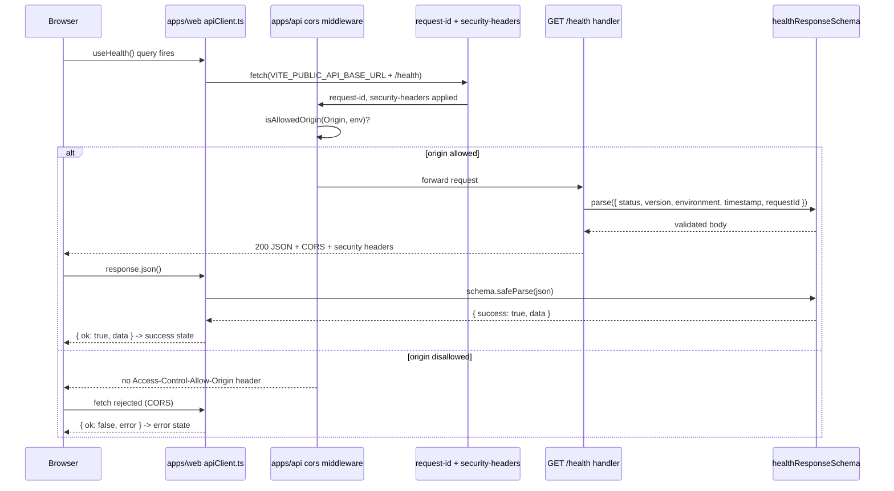

# Frontend ↔ Backend Integration

Follows the mandatory template from `docs/PROJECT_PLAN.md` §12.

**Gist:** `apps/web`'s single page now fetches from `apps/api`'s
`GET /health` over CORS instead of showing a static placeholder. The
health response contract is a single zod schema shared from
`packages/types`, TanStack Query is the only server-state mechanism, and
the status panel renders four visually distinct states — loading,
success, error, offline — each independently demonstrable and each
covered by its own Playwright spec.

**Technical Detail:**

- **Shared contract (R3):** `healthResponseSchema` / `HealthResponse`
  live in `packages/types/api.ts` and are exported from the barrel
  (`packages/types/index.ts`). Both `apps/api` (parses its own response
  before returning it, `apps/api/src/routes/health.ts`) and `apps/web`
  (parses the response before trusting it, `apps/web/src/lib/apiClient.ts`)
  import the same type from `@avash/types` — zero duplicate definitions
  (grep-verified: `healthResponseSchema` / a matching `z.object` only
  exists in `packages/types/api.ts`).
- **`apps/web/src/lib/apiClient.ts` (`fetchApi`):** a typed fetch wrapper.
  Base URL comes only from `import.meta.env.VITE_PUBLIC_API_BASE_URL`
  (R2 — public-prefixed, statically accessed so the eslint secrets-boundary
  rule can verify it); every request is bounded by an `AbortController`
  timeout (`API_CLIENT_TIMEOUT_MS`, §14); every response is zod-parsed
  with `schema.safeParse` before being handed back; the result is a
  discriminated union (`{ ok: true, data } | { ok: false, error }`) rather
  than a thrown exception, so a caller can never accidentally leak a raw
  error (R10). `response?.ok`, `response.json?.()`, and `parsed?.success`
  all use optional chaining (R4).
- **`apps/web/src/lib/env.ts`:** fails fast at module load if
  `VITE_PUBLIC_API_BASE_URL` is unset, with a message naming the exact
  fix (`cp apps/web/.env.example apps/web/.env`) instead of letting
  `undefined` reach `fetch()` silently.
- **TanStack Query:** `apps/web/src/lib/queryClient.ts` sets `retry: 1`,
  `staleTime: 30_000`, `refetchOnWindowFocus: false`; `App.tsx` wraps the
  router in `QueryClientProvider`. `apps/web/src/features/health/useHealth.ts`
  is the only data-fetching code path for `/health` — a `useQuery` hook,
  not a `useEffect`. Zero `useEffect`-based data fetching exists anywhere
  under `apps/web/src` (grep-verified).
- **Four UI states (`apps/web/src/pages/Home.tsx`):** driven by
  `useOnlineStatus()` (`apps/web/src/hooks/useOnlineStatus.ts` — subscribes
  to `window`'s `online`/`offline` events with cleanup on unmount) and
  `useHealth()`'s `isLoading` / `isError` / success flags, in that priority
  order: **offline** overrides everything; otherwise **loading** shows a
  fixed-height skeleton (no layout shift on resolution); otherwise
  **error** shows a generic, translation-free message (R10 — never the
  underlying fetch/parse error); otherwise **success** renders
  `status`/`environment`/`version` from the parsed body. Each state has a
  stable `data-testid` (`status-offline` / `status-loading` /
  `status-error` / `status-success`) for deterministic test targeting.
- **CORS, local dev (`apps/api`):** the Vite dev origin
  (`http://localhost:5173`) is added to `CORS_ALLOWED_ORIGINS` only via
  `apps/api/.dev.vars` (gitignored, templated by `.dev.vars.example`),
  which `wrangler dev` reads in preference to `wrangler.toml`'s `[vars]`.
  `wrangler.toml`'s `[vars]` / `[env.preview.vars]` / `[env.production.vars]`
  are untouched — no `localhost` entry exists in any deployed environment
  (`docs/standards/backend.md`).
- **CSP `connect-src` (`apps/web/public/_headers`):** the frontend-scaffold placeholder
  (`https://api.avash.example.placeholder`) is replaced with the real
  `apps/api` Worker name (`https://avash-api-production.workers.dev`,
  matching `wrangler.toml`'s `[env.production]` block — still a
  placeholder pending a real Cloudflare account subdomain/custom domain,
  tracked the same way as `CORS_ALLOWED_ORIGINS` in
  `docs/constants-registry.md`). No Gemini domain appears in the client
  CSP — the browser never calls Gemini directly.
- **Root dev orchestration:** `pnpm dev` (`turbo run dev`) runs both
  `apps/web`'s Vite dev server and `apps/api`'s `wrangler dev`
  concurrently — documented in `CLAUDE.md` and `README.md`'s Quickstart.
- **Testing:**
  - `apps/api/test/routes/integration.spec.ts` — the health body's keys
    match the shared schema's keys exactly, and both `OPTIONS` preflight
    directions (allowed origin → `204` + matching header; disallowed
    origin → `403`, no header).
  - `apps/web/e2e/health-integration.spec.ts` — five specs using
    Playwright's `page.route`/`fulfill` network interception: the four UI
    states (deterministic, no manual server start/stop required) plus a
    fifth proving a schema-invalid-but-well-formed-JSON payload is
    rejected rather than rendered. The schema-rejection spec was proven to
    fail when the zod parse was temporarily removed from `apiClient.ts`,
    then the removal was reverted (see Security Considerations).

**Request lifecycle:**

**CORS configuration matrix:**

| Environment | `CORS_ALLOWED_ORIGINS` source | Includes `localhost:5173`? |
|---|---|---|
| Local dev (`wrangler dev`) | `apps/api/.dev.vars` (gitignored, overrides `wrangler.toml`) | Yes |
| Preview (`[env.preview]`) | `apps/api/wrangler.toml` `[env.preview.vars]` | No |
| Production (`[env.production]`) | `apps/api/wrangler.toml` `[env.production.vars]` | No |

**Shared-contract rule:** any request/response shape crossing the
`apps/web` ↔ `apps/api` boundary is defined exactly once, as a zod schema
in `packages/types`, and both sides import it from `@avash/types` (R3).
Neither app may redeclare the shape inline.

**UI state → Playwright spec mapping:**

| UI state | `data-testid` | Spec in `apps/web/e2e/health-integration.spec.ts` |
|---|---|---|
| Success | `status-success` | "success — live values render from an intercepted `/health` response" |
| Loading | `status-loading` | "loading — skeleton appears, then resolves with no layout shift" |
| Error | `status-error` | "error — generic message renders, no raw error or stack in the DOM" |
| Offline | `status-offline` | "offline — offline state renders when the browser is offline" |

**Critical Constants:**

| Constant | Value | Defined in | Status |
|---|---|---|---|
| `API_CLIENT_TIMEOUT_MS` | 8000 | `apps/web/src/lib/apiClient.ts` | implemented |
| `CORS_ALLOWED_ORIGINS` | production Pages domain + PR preview pattern (+ `localhost:5173` in local `.dev.vars` only) | `apps/api/wrangler.toml`, `apps/api/.dev.vars.example` | implemented |

**Security Considerations:**

- R2 (secrets never reach the client): `VITE_PUBLIC_API_BASE_URL` is the
  only env var `apiClient.ts`/`env.ts` reference, both as a static
  `import.meta.env.VITE_PUBLIC_*` property access; zero non-`VITE_PUBLIC_`
  references exist under `apps/web/src` (grep-verified).
- R3: the health contract is defined exactly once, in `packages/types`.
- R4: every untrusted access point in `apiClient.ts`
  (`response?.ok`, `response.json?.()`, `parsed?.success`) and in
  `useHealth`/`Home.tsx` (`health.data?.status` etc.) uses optional
  chaining.
- R10: the error state renders a fixed, generic string
  ("API: unavailable right now. Please try again later.") — proven with
  a dedicated Playwright case that fulfills `/health` with a `500` body
  containing the literal string `"boom"` and asserts `"boom"` and
  `"stack"` never appear anywhere in the rendered DOM.
- Schema-rejection proven negatively: the zod `safeParse` call was
  temporarily removed from `apiClient.ts` (returning the raw JSON
  unchecked), the "rejects a schema-invalid payload" spec was re-run and
  failed as expected (the invalid payload's `"unexpected"` key rendered
  into the DOM), and the removal was then reverted — evidence this test
  actually exercises the schema boundary rather than passing vacuously.
- CORS: local-only origin addition lives solely in `apps/api/.dev.vars`
  (gitignored); `wrangler.toml`'s three `[vars]` blocks were not modified,
  so no deployed environment can ever be reached from `localhost`.

**Manual Test Log:** not yet run as a formal signed-off pass. Manual
verification during development: both dev servers started with `pnpm dev`,
the page rendered live `{ status: "ok", environment: "development",
version: "1.0.0" }` from the real `wrangler dev` instance; loading state
observed under throttled network; error state observed with `apps/api`
stopped (generic message, no raw error); offline state observed via the
browser's offline toggle. The formal, reviewer-signed three-pass log is
completed as part of the project's final verification sweep
(`docs/standards/testing.md`). Last pass test date: none.
